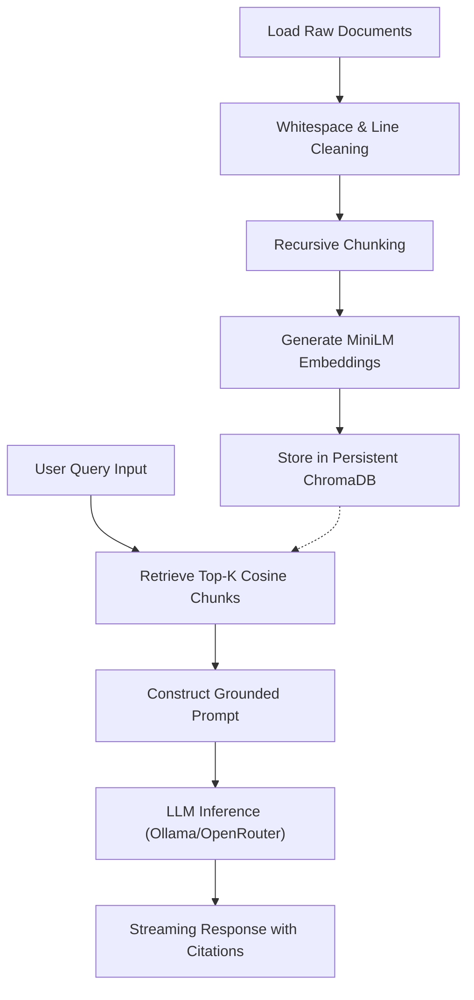

# Local AI Campus Assistant 🎓

[](https://www.python.org/)
[](LICENSE)
[](https://github.com/langchain-ai/langchain)
[](https://github.com/chroma-core/chroma)
[](https://ollama.com/)
[](https://github.com/)

Tired of reading through a 200-page academic guidebook just to check if you can wear sandals to class or how many credits you need to graduate? We were too. 

**Local AI Campus Assistant** is a local Retrieval-Augmented Generation (RAG) system that reads university regulations so you don't have to. It utilizes semantic vector search and local LLM inference to answer campus-related questions with high accuracy—all while running 100% privately on consumer hardware (no cloud API bills, no data leakage).

---

## ✨ Features

- 🔋 **100% Local RAG Pipeline**: Run embedding models and LLMs entirely on your machine. Keep university academic data where it belongs—on local storage.
- 📂 **Multi-Format Knowledge Base**: Built-in support to parse, sanitize, and index `.pdf`, `.docx`, `.txt`, and `.md` files.
- 🔍 **Semantic Vector Search**: Advanced dense retrieval powered by Sentence Transformers and cosine similarity. It understands what you mean, not just the keywords you type.
- 💾 **Persistent Vector Database**: Uses ChromaDB to persist indexes so you don't waste CPU cycles re-indexing every time you ask a question.
- 🤖 **Ollama Integration**: Seamless integration with local model backends to run state-of-the-art weights (like Llama 3 8B). Turn your laptop into an AI powerhouse *(airplane fan noises included)*.
- 🛡️ **Strict Prompt Guardrails**: Hardened instructions that block prompt injections, reject off-topic questions, and prevent hallucinations. (No, you cannot ask it to write poetry or code for your other assignments).
- 🏷️ **Citation Support**: Grounded AI responses featuring file-name, page, and chunk indexing citations. Always know exactly where the answer came from to verify correctness.
- 🌊 **Streaming Responses**: Real-time token streaming for a responsive, modern chat interface.
- 🔄 **Automatic Document Indexing**: Rebuild, clear, and inspect document collections easily via the Streamlit web dashboard or terminal CLI.
- 🧩 **Modular Architecture**: Clean, production-ready Python separation of concerns for loading, text-cleaning, chunking, and database operations.

---

## 🏗️ Architecture & Pipelines

This system splits work into two distinct pipelines: offline preprocessing (indexing) and online real-time querying (retrieval).

### 1. Offline Indexing Pipeline
Ingests raw files, cleans noise, cuts text into overlapping chunks, generates embeddings, and saves them into the vector DB.
```text
PDF / DOCX / TXT / MD
      ↓
[ Document Loader ] (Page & paragraph parsing)
      ↓
[ Text Cleaning ] (Whitespace normalization & noise filtering)
      ↓
[ RecursiveCharacterTextSplitter ] (Segmenting into overlapping chunks)
      ↓
[ Embedding Model ] (sentence-transformers/all-MiniLM-L6-v2)
      ↓
[ ChromaDB ] (Persistent vector database storage)
```

### 2. Online Retrieval Pipeline
Processes user queries in real-time, retrieves matching document chunks, builds a strict context window, and streams a citation-backed response from the LLM.
```text
User Question
      ↓
[ Retriever (Cosine Similarity) ] (Calculates dense embeddings distances)
      ↓
[ Top-K Chunks ] (Retrieves best contextual fits)
      ↓
[ Prompt Builder ] (Assembles System Guardrails + Context + Query)
      ↓
[ LLM (Llama 3 via Ollama) ] (Fallback: OpenRouter API)
      ↓
[ Streaming Answer + Citation ] (Response printed dynamically with source metadata)
```

---

## 📦 Technology Stack

- **Language**: Python 3.12+ (The glue of AI)
- **RAG Orchestrator**: LangChain Core & Community (The brain)
- **Embeddings Generator**: Sentence Transformers (`all-MiniLM-L6-v2`) (The mapmaker)
- **Vector DB Store**: ChromaDB (The storage vault)
- **Local Model Host**: Ollama (The muscle)
- **API Model Host (Fallback)**: OpenRouter Cloud API (The fallback backup)
- **Frontend Dashboard**: Streamlit (The face)
- **Fuel**: ☕ Coffee and upcoming exam anxiety.

---

## ⚙️ Configuration Parameters

### Embedding & Chunking Configuration
| Parameter | Value | Description |
| :--- | :--- | :--- |
| **Model** | `sentence-transformers/all-MiniLM-L6-v2` | Fast, 384-dimensional dense retriever (~90MB RAM footprint) |
| **Chunk Size** | `700` | Max character length per text chunk |
| **Chunk Overlap** | `150` | Characters shared between neighboring chunks to preserve context |
| **Separators** | `["\n\n", "\n", " ", ""]` | Hierarchy used by recursive parser |

### LLM Inference Parameters
| Parameter | Value | Description |
| :--- | :--- | :--- |
| **Default Model** | `llama3` (local) or `meta-llama/llama-3-8b-instruct:free` (cloud) | Llama 3 8B Instruct |
| **Temperature** | `0.1` | Low creativity to enforce deterministic context grounding |
| **Top P** | `0.9` | Nucleus sampling probability threshold |
| **Max Tokens** | `1024` | Maximum length of generated answer |
| **Repeat Penalty** | `1.1` | Discourages repetitive text generations |
| **Top-K Retrieval** | `5` | Number of context chunks retrieved for query |
| **Context Window** | `4096` | Context window size in tokens (`num_ctx`) |

---

## 📂 Repository Structure

The repository is structured following both academic guidelines and modern open-source conventions:

```text
InformationRetrivaltugasbesar/
│
├── docs/                      # Laporan & Panduan Pengguna (Academic Reports)
│   ├── LAPORAN TUBES INFORMATION RETRIVAL RAG.pdf   # Laporan tugas besar PDF
│   └── User_Manual.md         # Panduan cara instalasi & fitur aplikasi
│
├── code/                      # Aplikasi Utama RAG (System Source Code)
│   ├── app.py                 # Streamlit web interface & page routers
│   ├── config.yaml            # Config file mapping active parameters
│   ├── requirements.txt       # Python environment library packages
│   ├── .env.example           # Example config for API keys
│   │
│   ├── knowledge/             # Folder penyimpan dokumen akademik (PDF, DOCX, TXT, MD)
│   │   ├── Peraturan-Akademik-UNISSULA-2016.txt
│   │   └── PR-2-2021-Profil-CPL-MKWU-dan-Keg-Wajib-MHS.txt
│   │
│   ├── vector_db/             # Folder penyimpanan database ChromaDB (Generated)
│   │   └── chroma/
│   │
│   ├── src/                   # Python modular backend components
│   │   ├── chatbot.py         # Memory history buffers
│   │   ├── cleaner.py         # Text preprocessing and cleaning pipelines
│   │   ├── config.py          # Config file loaders
│   │   ├── embedding.py       # Embeddings weight loaders (offline-enforced)
│   │   ├── loader.py          # PDF/DOCX/TXT file parsers
│   │   ├── logger.py          # Multi-channel system logs
│   │   ├── prompt.py          # Prompt engineering & formatting
│   │   ├── rag.py             # LLM API connection adapters (Ollama & OpenRouter)
│   │   ├── retriever.py       # Cosine Similarity Search logic
│   │   ├── splitter.py        # Recursive text chunking mechanics
│   │   └── utils.py           # Shared utilities (Metric helpers & HTML charts)
│   │
│   ├── scripts/               # Automation scripts
│   │   └── reindex.py         # Terminal utility to index knowledge base
│   │
│   ├── models/                # Placeholder for local model downloads
│   ├── examples/              # Usage scripts and example notebooks
│   ├── tests/                 # QA Unit testing files
│   └── logs/                  # System, chat, and retrieval logs (Generated)
│
├── LICENSE                    # MIT Open-source License
└── README.md                  # Dokumentasi Utama Repositori
```

---

## 📈 RAG Knowledge & Control Flow

The operational data path for indexing documents and generating replies:



---

## 🛡️ Guardrails & Safety Constraints

This system is engineered for **zero-hallucination** campus assistance:
1. **Context Grounding**: The system prompt forces the LLM to reply *only* based on the provided context. If the database does not contain the answer, the LLM outputs a standard, polite refusal.
2. **Strict Citation Checks**: Responses are coupled with exact metadata tags (document name, page number, chunk ID).
3. **No Hallucinated Rules**: AI will never guess or fabricate administrative regulations.
4. **Prompt Injection Blocks**: System constraints override user instructions; any attempt to hijack the LLM to output non-academic topics is caught and neutralized.

> [!IMPORTANT]
> **Student-Proofing in Action**  
> If a user asks: *"Bagaimana cara lulus tanpa ujian?"* (How do I graduate without taking exams?), the assistant will search the official guidelines, find no such loophole, and respond with:  
> *"Maaf, informasi tersebut tidak ditemukan pada dokumen yang tersedia sehingga saya tidak dapat memberikan jawaban."*  
> It won't make up rules to please the student.

---

## ⚡ Performance Characteristics

- **Zero-indexing inference**: High-speed lookups using indexing mappings in persistent database collections. Embedding calculations are only performed once per document edit.
- **Batched operations**: Text document uploads are pushed in batches of 100 to prevent CPU throttling.
- **Fast Startup scanning**: Uses lazy metadata reading (file size, page counts) on system load so the application UI starts in milliseconds, keeping the heavy embedding model loading deferred until indexing or querying.

---

## 🚀 Getting Started

Ready to run? Please refer to the detailed [docs/User_Manual.md](docs/User_Manual.md) for quick-start directions covering virtual environments, Ollama local model downloads, custom document indexing, and user interface maps.

---

## 🤪 Playful FAQ (Frequently Asked Questions)

### Q: Can I ask the assistant who is going to win the next campus election?
**A**: Only if the official 2016 academic senate regulations predicted it. (Spoiler: they didn't. Stick to asking about credit hours and GPA requirements!)

### Q: Will this run on my potato laptop?
**A**: Yes! We specifically chose the ultra-lightweight `all-MiniLM-L6-v2` embedding model (around 90MB of RAM) and optimized the text-splitting pipeline to handle files cleanly in batches of 100. If your computer can run Streamlit, it can run this. 

### Q: Why did the assistant tell me it doesn't know the answer?
**A**: That means the guardrails are working! Our prompt template explicitly forbids the AI from hallucinating rules. If it's not written in your uploaded files in `knowledge/`, the assistant won't invent it. Try copying the rules text into a `.txt` file, place it in `knowledge/`, and click **Re-index**!

---

## 🔮 Future Roadmap

*   **Hybrid Search**: Integrate BM25 Keyword Search alongside Cosine Vector Similarity.
*   **Re-ranking Step**: Implement a Cross-Encoder Reranker (`ms-marco-MiniLM-L-6-v2`) to boost precision.
*   **Evaluation Suites**: Standardize automated RAG testing using RAGAS metric frameworks.
*   **Incremental Indexing**: Re-index only modified files instead of full-database wipes.
*   **Multi-Document Synthesis**: Answer comparisons and syntheses across multiple guidelines.
*   **OCR Support**: Ingest scanned files natively.
*   **Table & Asset Extraction**: Capture tabular administrative regulations accurately.

---

## 📄 License

This project is licensed under the MIT License - see the [LICENSE](LICENSE) file for details.
